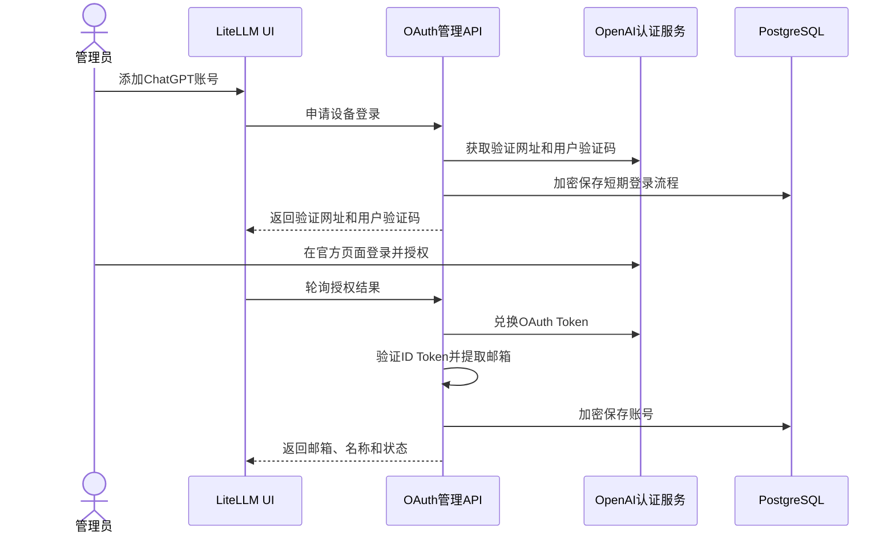

# ChatGPT OAuth 多账号设计

## 元信息

- target: `litellm_internal_staging@bd44c9e305`
- scope: LiteLLM Proxy、Router、Admin UI、`litellm/llms/chatgpt`
- status: draft
- detail: [负载均衡与 Token 轮转](./ROUTING_AND_TOKEN_ROTATION.md)
- test: [开发与发布测试计划](./TEST_PLAN.md)

## 问题背景

当前 ChatGPT Provider 从 `CHATGPT_TOKEN_DIR` 或 `CHATGPT_AUTH_FILE` 读取单个本地认证文件。同一 Proxy
进程内的 Deployment 默认共享该身份，无法通过 Admin UI 管理多个账号，也不适合 Kubernetes 多副本刷新。

本设计把 ChatGPT OAuth 账号作为数据库资源管理：管理员通过 OpenAI 官方页面登录，LiteLLM 加密保存 OAuth Token，
Deployment 只引用账号 ID。

## 核心结论

1. LiteLLM 不保存 ChatGPT 密码、MFA 或浏览器 Cookie，只保存 OAuth Token。
2. Admin UI 可以添加、查看、检索、停用和重新授权账号；邮箱仅对管理员展示。
3. Token 和邮箱加密存入 PostgreSQL；`LITELLM_SALT_KEY` 由部署环境提供。
4. 一个 Deployment 绑定一个 OAuth Credential；一个 Credential 可以被多个 Deployment 复用。
5. 数据库 OAuth 模式默认后台提前刷新 Token，请求路径保留兜底刷新。
6. 旧文件模式继续兼容，但数据库 Credential 配置失败时禁止静默回退到文件账号。

## 现状链路

| 模块 | 现状 | 需要调整 |
| --- | --- | --- |
| Chat/Responses Transformation | 读取进程级 `Authenticator` | 按 Deployment 解析 Credential |
| `Authenticator` | 登录、读取和刷新本地文件 | 抽取可复用 OAuth Client，增加数据库 Account Service |
| Router | 支持同模型多 Deployment | 关联账号状态并按 Deployment 归因 |
| Credential 管理 | 面向静态 Provider 密钥 | 增加 ChatGPT OAuth 账号页面和 Device Flow |
| 数据库加密 | 已有 `LITELLM_SALT_KEY` | OAuth 新数据强制显式 Salt Key 和 AEAD |

## 目标行为

### Admin UI

Proxy Admin 可以：

- 添加账号并跳转到 OpenAI 官方验证页面
- 查看账号邮箱、运维名称、状态、Token 到期时间和关联 Deployment 数
- 按邮箱精确检索
- 停用、启用、重新授权和删除未被引用的账号
- 在 Deployment 表单中选择账号

UI 永不展示密码、MFA、Cookie、Access Token、Refresh Token、ID Token、Account ID 或数据库密文。

邮箱从经过密码学验证的 ID Token 提取，校验签名、issuer、audience 和有效期；不能由管理员手填，也不能只做 JWT
Base64 解码。现有 ChatGPT Device Auth 接口不接受 nonce，因此登录链路沿用其返回的 Authorization Code 和 Code
Verifier 完成 PKCE 交换。完整邮箱加密存储并仅在 Admin API 返回；检索使用规范化邮箱的 HMAC 指纹。

### 登录流程



Device Auth ID、Authorization Code 和 Code Verifier 都是短期协议字段，不是密码。它们加密保存、绑定发起管理员、
最长保留15分钟，完成后立即失效；只有验证网址和 User Code 可以短暂返回当前 UI。

### Deployment 绑定

新增 `chatgpt_oauth_credential_id`：

```yaml
model_list:
  - model_name: shared-codex
    model_info:
      id: chatgpt-account-a
    litellm_params:
      model: chatgpt/responses/gpt-5.4
      chatgpt_oauth_credential_id: account-a-uuid

  - model_name: shared-codex
    model_info:
      id: chatgpt-account-b
    litellm_params:
      model: chatgpt/responses/gpt-5.4
      chatgpt_oauth_credential_id: account-b-uuid
```

绑定规则：

- 一个 Deployment 只能绑定一个 Credential
- 一个 Credential 可以服务多个 Deployment 或模型
- 停用或失效账号后，所有引用它的 Deployment 均不可选
- 删除被引用账号返回冲突错误，不做级联删除

固定模型、wildcard 动态模型、负载均衡和失败重入规则见
[负载均衡与 Token 轮转](./ROUTING_AND_TOKEN_ROTATION.md)。

### 认证选择优先级

1. `chatgpt_oauth_credential_id`：数据库账号
2. 显式 `chatgpt_auth_file`：旧文件模式
3. `CHATGPT_TOKEN_DIR` / `CHATGPT_AUTH_FILE`
4. 默认本地 `auth.json`

一旦指定数据库 Credential ID，记录缺失、停用或解密失败时直接报错，禁止切换到其他文件账号。

## 实现方案

### 分层

```text
Admin UI / CLI
      -> OAuth Management API
      -> ChatGPTOAuthAccountService
           -> OpenAIAuthClient
           -> AccountRepository
           -> OAuthTokenCipher
      -> PostgreSQL

LLM Request
      -> ChatGPTCredentialResolver
      -> ChatGPTOAuthAccountService
      -> ChatGPT Provider
```

UI、CLI、请求路径和后台刷新器共用 Account Service。Provider Transformation 不直接访问 Prisma、解密 Token 或实现刷新。

### 数据模型

新增两张表：

| 表 | 保存内容 |
| --- | --- |
| OAuth Account | Credential ID、运维名称、Token 密文、邮箱密文和指纹、状态、到期时间、版本、刷新租约/退避、审计字段 |
| Pending OAuth Flow | Flow ID、加密协议字段、发起管理员、用途、状态和到期时间 |

Token record 整体使用版本化 AES-256-GCM 加密，AAD 绑定 Credential ID、Provider 和格式版本。Token 明文只短暂存在于
进程内存，不进入日志、缓存后端或 API 响应。

主要状态为：

```text
pending -> active -> reauth_required
                  -> disabled
reauth_required / disabled -> active（重新授权或验证成功）
```

### 管理 API

| 能力 | API 行为 |
| --- | --- |
| 开始登录 | 创建 Device Flow，返回官方验证信息 |
| 轮询登录 | 推进授权并创建或更新账号 |
| 列表/详情 | 返回管理员可见邮箱、状态和关联数，不返回 Token |
| 重新授权 | 为已有账号创建新的 Device Flow |
| 启用/停用 | 更新账号状态并使路由缓存失效 |
| 删除 | 仅允许删除无 Deployment 引用的账号 |

所有接口只允许 Proxy Admin，并使用现有管理认证、CSRF/同源保护、限流和审计。

### Token 刷新与路由

数据库 OAuth 模式默认启动专用后台刷新器：每60秒扫描一次，提前5分钟刷新即将到期且正在使用的账号。它只调用 OAuth
Token endpoint，不调用模型，也不消耗模型 Token。请求路径在到期前60秒保留兜底刷新。

多副本通过 Credential 短租约和 `token_version` CAS 去重。刷新、动态模型、负载均衡、Cooldown、Fallback、失败退避和
监控的完整规则只在[负载均衡与 Token 轮转](./ROUTING_AND_TOKEN_ROTATION.md)维护。

### Provider 接入

Chat 和 Responses 共用解析链路：

```text
chatgpt_oauth_credential_id
  -> ChatGPTCredentialResolver
  -> AccountService.get_valid_access_token
  -> Authorization + ChatGPT-Account-Id
```

身份数据保持在当前调用栈，不能写入会跨请求复用的 Provider Config。客户端传入的身份 Header 必须被服务端结果覆盖。

## 密钥与部署

### `LITELLM_SALT_KEY`

`LITELLM_SALT_KEY` 虽然名字包含 `SALT`，在 LiteLLM 中实际承担数据库敏感字段的对称加密根密钥。它不是 ChatGPT
密码，不发送给 OpenAI，也不属于某一个账号。

- 首次部署前生成至少32字节随机值
- 通过 Kubernetes Secret、External Secrets 或 KMS 注入所有 Proxy Pod
- 与数据库备份分开保存，并确保所有副本使用同一个值
- 首版不做周期轮换；丢失后历史 Token 无法恢复
- 禁止只更新 Secret 后重启；真正轮换需要专项的双密钥重加密流程

当前 LiteLLM 在未设置 Salt Key 时可能回退到 `LITELLM_MASTER_KEY`。数据库 OAuth 模式不沿用该回退：必须显式配置独立
Salt Key，缺失时禁止创建和使用数据库账号。

Docker Compose 从 `.env` 注入，Helm 引用 `existingSecret`。不为每个 ChatGPT 账号创建 Kubernetes Secret；数据库只保存
密文，集群侧只保存一把长期加密密钥。Pod ServiceAccount 只需要读取指定 Secret，不需要 list/watch 整个命名空间。

### 数据库迁移

需要正式 Prisma migration，新增 OAuth Account、Pending Flow 和必要索引。迁移是增量 DDL，不修改旧业务数据。

部署顺序：

```text
备份数据库和Salt Key
  -> 使用目标版本镜像执行 prisma migrate deploy
  -> migration成功
  -> 启动/滚动更新Proxy
  -> UI创建账号并绑定Deployment
```

Migration Job 只需要数据库 DDL 权限，不需要 Salt Key；运行时 Pod 需要 DML 权限、`DATABASE_URL` 和 Salt Key。
OAuth 状态、刷新和删除引用检查全部访问 writer database。

无 PostgreSQL 的 SDK 或 Proxy 继续使用旧文件模式；Admin UI 的数据库账号功能显示不可用，不把 Token 写入容器临时文件。

## 边界与兼容性

| 项目 | 结论 |
| --- | --- |
| Admin UI 管理多个 OAuth 账号 | 本期实现 |
| Chat 和 Responses 使用数据库账号 | 本期实现 |
| 多副本主动刷新 | 本期实现 |
| 旧文件模式 | 保持兼容 |
| 从旧 `auth.json` 自动导入 | 后续实现；首期重新授权 |
| 每账号 Kubernetes Secret | 不采用 |
| 保存密码、MFA、Cookie | 禁止 |
| 查询订阅剩余额度 | 暂不实现，缺少稳定接口 |
| 准确美元成本 | 不承诺，ChatGPT Subscription 没有公开 Token 单价 |
| 外部 Vault Token Store | 后续可插拔能力 |

## 安全设计

| 风险 | 控制 |
| --- | --- |
| 数据库泄露 | Token 与邮箱使用独立 Salt Key 做 AEAD 加密，数据库和密钥分权 |
| 管理员滥用 | Admin-only、SSO/MFA、CSRF、限流和审计 |
| Device Flow 被接管 | Flow 绑定管理员、短 TTL、一次性和幂等校验 |
| Token 泄露到 UI/日志 | 固定响应 DTO、日志字段 allowlist、OAuth body 禁止记录 |
| 跨账号串号 | 显式 Credential ID 失败即停止，不降级到文件账号 |
| 并发刷新覆盖 | Credential 短租约、`token_version` CAS 和缓存失效 |
| 邮箱泄露 | 邮箱密文仅 Admin 解密；日志和监控只使用无 PII ID |
| 授权撤销 | 标记 `reauth_required`，停止刷新和路由，并提示管理员重新授权 |

## 风险

| 风险 | 处理 |
| --- | --- |
| ChatGPT 后端协议变化 | Provider 隔离、错误监控，不影响 OpenAI Platform Provider |
| Salt Key 丢失 | 独立备份；无法恢复时要求账号重新授权 |
| 后台刷新器异常 | 请求路径兜底刷新并触发告警，不使整个 Proxy readiness 失败 |
| Migration 失败 | 阻止应用 rollout，不允许应用 Pod 并发迁移 |
| 订阅账号共享受上游限制 | 明确产品边界，监控 401/429，不宣称公共 API SLA |

## 覆盖矩阵

| 场景 | 必须证明 |
| --- | --- |
| UI 登录和重新授权 | 只在 OpenAI 官方页面登录；数据库只有密文；邮箱可由 Admin 查看和检索 |
| 权限和隔离 | 非管理员不能管理账号；Flow 不能被其他管理员接管 |
| Deployment 绑定 | Chat/Responses 使用绑定账号，失败时不回退其他文件身份 |
| 数据保护 | API、日志、Trace 和 Spend Logs 不包含 Token、Account ID 或邮箱 |
| 多副本刷新和路由 | 通过[独立覆盖矩阵](./ROUTING_AND_TOKEN_ROTATION.md#覆盖矩阵)验证 |
| Migration | 新旧数据库均可前向迁移；失败会阻止 rollout |
| Salt Key | 缺失或错误时安全失败；所有副本可解密同一校验密文 |
| 生命周期 | 停用、失效、重新授权和删除引用保护正确传播 |
| 兼容性 | 未配置数据库 Credential 时旧文件模式行为不变 |

## 动态参数

| 参数 | 含义 |
| --- | --- |
| `chatgpt_oauth_credential_id` | Deployment 绑定的数据库账号 ID |
| `model_info.id` | 无 PII 的稳定 Deployment 监控 ID |
| `LITELLM_SALT_KEY` | 数据库敏感字段加密根密钥 |
| `token_version` | 刷新 CAS 和缓存失效版本 |
| Device Flow TTL | 最长15分钟，并受上游有效期约束 |
| 后台刷新参数 | 默认每60秒扫描、提前5分钟刷新；详见独立运行时文档 |

## 备选方案

| 方案 | 结论 |
| --- | --- |
| 每账号文件/PVC | 只保留兼容，不作为主方案 |
| 每账号 Kubernetes Secret | Token 回写和 UI 管理复杂，不采用 |
| 通用静态 Credential 表 | 缺少 OAuth 状态和并发刷新语义，不直接复用 |
| 专用 OAuth Account 表 | 本设计采用 |
| 外部 Vault/KMS 保存每个 Token | 后续可插拔，不作为首期依赖 |

## 分阶段落地

第一阶段完成数据库表、加密、Admin UI/API、Device Flow、Deployment 绑定、Chat/Responses 接入、后台刷新、Router 归因、
迁移和旧文件兼容。

后续再考虑旧文件导入、外部 Token Store、KMS envelope encryption、自动密钥轮换、容量学习和上游 revoke endpoint。

## 结论

- product_code_change: 是
- case_doc_change: 是
- case_script_change: 是
- product_spec_change: 是

主方案使用 Admin UI 和 PostgreSQL 管理 ChatGPT OAuth 身份。Kubernetes 只提供数据库连接和长期固定的
`LITELLM_SALT_KEY`；Token 以密文保存，Deployment 只引用 Credential ID。运行时路由与刷新细节独立维护，主文档不重复展开。
